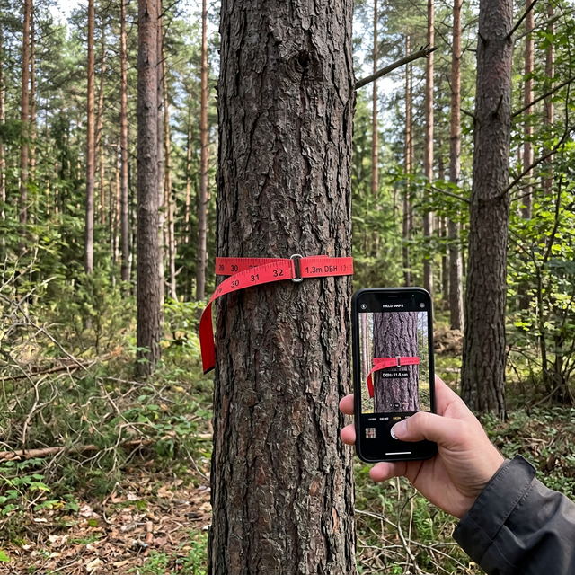

# 基于机器视觉的林木胸径测量系统

传统的林木胸径（DBH）测量需要人工用卷尺或测径器在树干1.3米高度处实地测量，一片林地上百棵树测下来耗时费力，特别是在地形复杂、树木密集的林区更加困难。本项目利用计算机视觉技术，通过手机拍摄树干照片，结合相机标定和图像分割算法自动计算树木胸径，实现非接触式测量。

## 痛点与目的

- **问题**：人工测量林木胸径效率低、劳动强度大，在大面积林地清查时成本很高
- **方案**：微信小程序拍照 → Python 后端处理图像 → 相机标定获取真实尺度 → K-means 分割树干区域 → 计算胸径
- **效果**：用手机拍一张照片即可估算树木胸径，减少实地测量工作量

## 测量场景



## 核心功能

- **微信小程序前端**：拍照上传树干图片
- **相机标定**：棋盘格标定获取相机内参，消除镜头畸变
- **图像分割**：K-means 聚类分割树干区域
- **胸径计算**：基于标定参数将像素距离转换为真实物理尺寸
- **Web 可视化**：Flask 后端提供结果展示页面

## 使用方法

### 后端启动

```bash
cd GraduationProject
pip install flask opencv-python numpy
python app.py
```

### 微信小程序

用微信开发者工具打开 `TreeMeasure/` 目录

## 项目结构

```
.
├── GraduationProject/           # Python 后端
│   ├── app.py                   # Flask 主程序
│   ├── biaoding.py              # 相机标定
│   ├── chessboard.py            # 棋盘格检测
│   ├── kmeans.py                # K-means 图像分割
│   ├── DBHuntil.py              # 胸径计算工具
│   ├── templates/               # Web 页面
│   └── static/                  # 静态资源
├── TreeMeasure/                 # 微信小程序
│   ├── pages/                   # 页面
│   ├── utils/                   # 工具函数
│   └── app.json                 # 小程序配置
└── TreeMeasure_repository/      # 数据仓库
```

## 技术栈

| 组件 | 技术 |
|------|------|
| 前端 | 微信小程序 |
| 后端 | Python Flask |
| 图像处理 | OpenCV |
| 分割算法 | K-means 聚类 |
| 标定 | 棋盘格相机标定 |

## 许可证

MIT 许可证
